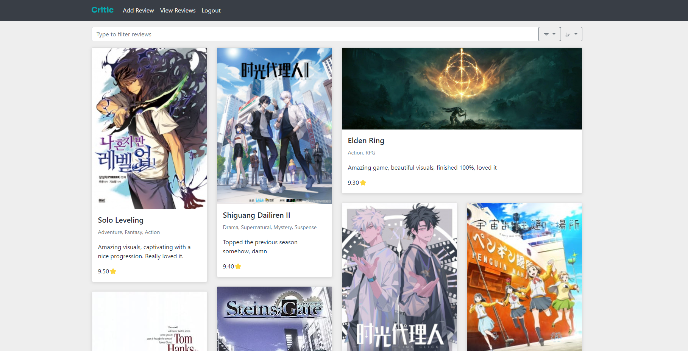
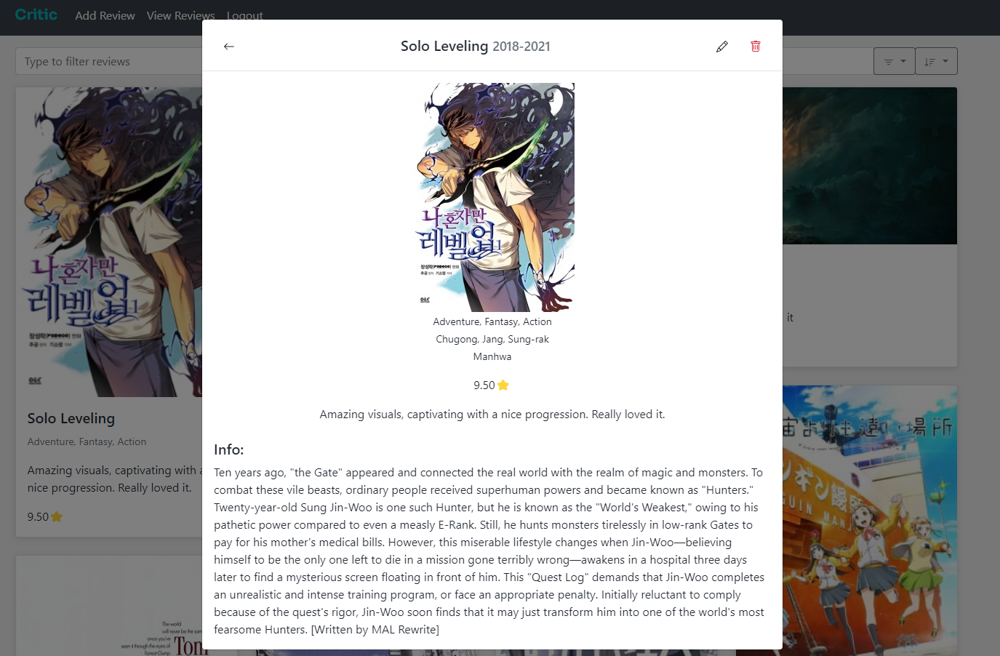
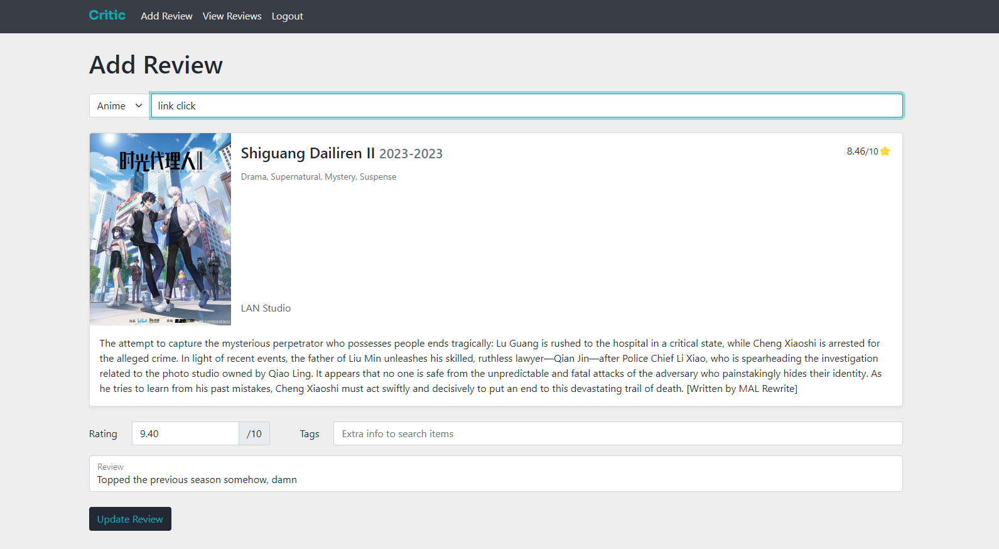

# Critic App

> A WIP. I use it personally to store reviews. You can try it out if you want.

A place to store your personal reviews.

Ever had a brain fart moment when someone asked you for your top horror movies or for indie game suggestions? Yeah, me too. This is a solution to that to provide a database for your reviews so they are easily retrievable. Some required features:
- **Easy to add** - Minimum friction on adding new reviews. Autocomplete details, no big reviews needed. Just a rating number is good enough.
- **Easy to fetch** - Should be possible to do keyword searches like 'horror', 'anime', or just an actor or writer name.
- **Mobile compatible** - Shouldn't have to open a laptop for adding or searching reviews.
- **Extensible** - New categories should be easy to add on. Maybe I want to review tweets later. As long as there is a details source, should be easy to add on.

## How to host

You can follow the instructions from Digital Ocean for setting up a django server. (https://www.digitalocean.com/community/tutorials/how-to-set-up-django-with-postgres-nginx-and-gunicorn-on-ubuntu-16-04) 

These API keys need to be set for fetching details in their category

`OMDB_API_KEY` for movies - get from [OMDb](https://www.omdbapi.com/)

`RAWG_API_KEY` for games - get from [RAWG](https://rawg.io/)

The above API keys need to be set as environment variables either by creating a `.env` file in the repo root.
You can use the `.env.example` as reference if needed.

## Screenshots

While not so great, this is how the current version looks like this. Would probably change

